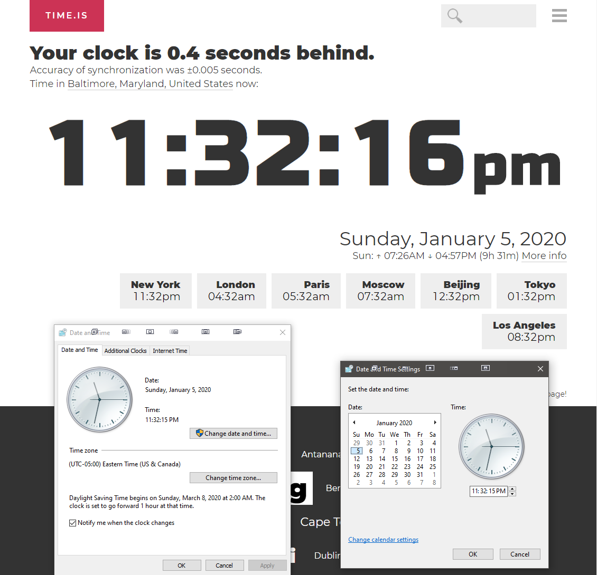

# SIS Bot #

This selenium bot allows you to register for classes on the Johns Hopkins SIS portal right at 7:00 AM, virtually guaranteeing a spot in all of your classes.

## Setup Instructions ##
Make sure Python 3 is installed on your computer. Run the following command in terminal:

    pip install -r requirements.txt

You will need to have a package manager installed on your computer, [Chocolatey](https://chocolatey.org/) for Windows or [Homebrew](https://brew.sh/) for macOS. Run the command that corresponds to which package manager you have installed:

    choco install chromedriver
<!-- -->
    brew install chromedriver

Download the bot.py file to your computer. In terminal, navigate to its folder. 

SIS uses the naval observatory clock to determine time. Therefore, your system must be synced to this clock to ensure the bot does not click too early or too late. On Mac OS, it is really easy to change your default. 

1. Navigate to System Preferences and click Date and Time. 
2. Click the lock on the bottom left of your window and enter your password. 
3. Change "Apple Americas/U.S. (time.apple.com.)" to "tick.usno.navy.mil"
4. Click the lock again to save your changes. 

On Windows, you'll have to manually set the time, as it can be inaccurate even when synced to the right clock.

1. Go to [time.is](https://www.time.is/) in a browser window
2. Open the Control Panel and search for Date and Time.
3. Click "Change date and time..."
4. In the new window that appears, type in the time so that it is about 0.15 seconds behind the time on time.is. You can refresh the page and it will tell you exactly how behind your time is.

## Running Instructions ##
Begin running at least a minute before 7:00 AM. The program will wait/keep running until 7:00 AM to register you for your classes. 

    python bot.py
